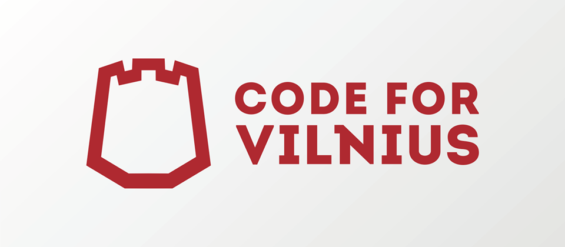

<p align="center">
  <a href="http://codeforvilnius.lt" target="_blank">
    
  </a>
</p>

# Car Plate Reader - Frontend

> **This repository is just for frontend code!** Backend code is located at
[cpr-server](https://github.com/vilnius/cpr-server) (not available yet).

> This code is written in [TypeScript](http://www.typescriptlang.org/) and is based
on [Angular2 Webpack Starter Kit](https://github.com/AngularClass/angular2-webpack-starter)
from [AngularClass](https://angularclass.com). Please read their great readme file for
all additional information.

## Quick start

```bash
# clone git repo
git clone https://github.com/vilnius/cpr-frontend.git

# change directory to repo
cd cpr-frontend

# install dependencies with npm
npm install
# sit back and relax, this will take a while
# it will also execute postinstall script that installs typescript typings

# start the server
npm start
```
Go to [http://0.0.0.0:3000](http://0.0.0.0:3000) or [http://localhost:3000](http://localhost:3000)
in your browser. By default server starts in development mode with hot reloading enabled.

## Scripts

### build files
```bash
# development
npm run build:dev
# production
npm run clean:dist
npm run build:prod
# all files can be found in folder 'dist'
```

### run tests
```bash
npm run test
```

### watch and run tests
```bash
npm run watch:test
```

### run end-to-end tests
```bash
# make sure you have your server running in another terminal
npm run e2e
```

### run webdriver (for end-to-end)
```bash
npm run webdriver:update
npm run webdriver:start
```

### run Protractor's elementExplorer (for end-to-end)
```bash
npm run webdriver:start
# in another terminal
npm run e2e:live
```

# License
 [MIT](/LICENSE)
